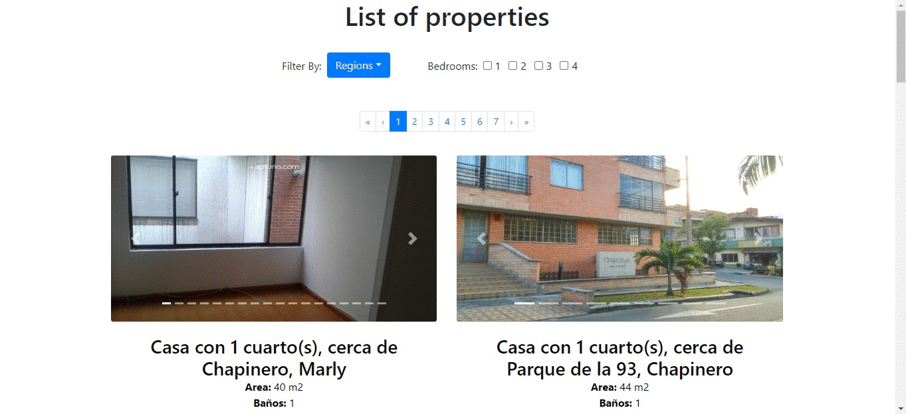

# gabogo-aptuno-frontend
Website built in react that list properties available in Bogota, and metropolitan area.

For the style I don't use any css preprocessor for this test, since I consider the test didn't required, to made the layout user friendly I imported react-bootstrap classes that also allows me to achive the responsive goal.

The site constant with two pages, one is the homepage with the list of all properties availables and the other one is the detailed page for a single property selected.

# Home page

The test requirements said that the layout could be a list or a grid, so I used a grid layout that shows the properties as cards organized by 2 per row, with a filter section and a pagination made by myself using bootstrap styling guide. By requirments only 12 cards per page must be displayed.

All cards have a carousel section to display all the properties images, this carousel section was created importing react-bootstrap/Carousel that brings the style and the logic of this component.

The filter section have a dropdown to filter the regions and a checkboxes to filter by rooms, once a filter is applied a "reset filters" shows up.

# Details page

This page is accessible by clicking the bottom of any property card where the info is displayed, and it redirects you using react-router module to the clicked property detailed page. 

This page have all the information I got from the API and is also reusing the carousel component to display all the images from the property, along with a map created importing 'react-leaflet' maps to display the location of the property.

## Components hierarchy

    App
    ├── Home
    │   ├── FilterContainer
    │   └── CardContainer
    │       └── Card
    │            └── Carousel
    └── Details
        ├── MapContainer
        │   └── Map
        └── Carousel
    
## Folder organization

    gabogo-aptuno-frontend
    ├── .gitignore
    ├── package.json
    ├── public
    │   ├── favicon.ico
    │   ├── index.html
    │   ├── manifest.json
    │   ├── robots.txt
    │   └── assets
    │       └── no-image.png 
    ├── README.md
    ├── src
    │   ├── App.css
    │   ├── App.js
    │   ├── App.test.js
    │   ├── index.css
    │   ├── index.js
    │   ├── logo.svg
    │   ├── serviceWorker.js
    │   ├── components
    │   │    ├── Cards 
    │   │    │    ├── Card.js 
    │   │    │    └── CardsContainer.js
    │   │    ├── Carousel
    │   │    │    └── Carousel.js
    │   │    ├── Filters
    │   │    │    └── FiltersContainer.js
    │   │    └── Map
    │   │         └── MapContainer.js
    │   └── Pages
    │        ├── Home.js
    │        └── Details.js
    └── yarn.lock

## Available Scripts

In the project directory, you can run:

### `npm start`

Runs the app in the development mode. 
Open [http://localhost:3000](http://localhost:3000) to view it in the browser.

The page will reload if you make edits. 
You will also see any lint errors in the console.

### `npm test`

Launches the test runner in the interactive watch mode. 
See the section about [running tests](#running-tests) for more information.

This script is really not running any test aside from the one create-react-app command created

### `npm run build`

Builds the app for production to the `build` folder. 
It correctly bundles React in production mode and optimizes the build for the best performance.

The build is minified and the filenames include the hashes. 
Your app is ready to be deployed!

See the section about [deployment](#deployment) for more information.

### `npm run eject`

**Note: this is a one-way operation. Once you `eject`, you can’t go back!**

If you aren’t satisfied with the build tool and configuration choices, you can `eject` at any time. This command will remove the single build dependency from your project.

Instead, it will copy all the configuration files and the transitive dependencies (Webpack, Babel, ESLint, etc) right into your project so you have full control over them. All of the commands except `eject` will still work, but they will point to the copied scripts so you can tweak them. At this point you’re on your own.

You don’t have to ever use `eject`. The curated feature set is suitable for small and middle deployments, and you shouldn’t feel obligated to use this feature. However we understand that this tool wouldn’t be useful if you couldn’t customize it when you are ready for it.
